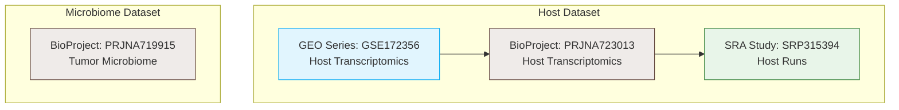

# Phase 1A: Authoritative Public-Data Source Audit and Accession Mapping

> [!NOTE]
> This audit provides a deterministic reconstruction of the dataset provenance, accession structure, and sample mappings for the study: *“Tumor microbiome contributes to an aggressive phenotype in the basal-like subtype of pancreatic cancer”* (Guo et al., 2021, *Communications Biology*, DOI: [10.1038/s42003-021-02557-5](https://doi.org/10.1038/s42003-021-02557-5), PMID: [34465850](https://pubmed.ncbi.nlm.nih.gov/34465850), PMCID: [PMC8408135](https://www.ncbi.nlm.nih.gov/pmc/articles/PMC8408135/)).

---

## 1. Verified Accession Hierarchy

The cohort consists of 62 pancreatic adenocarcinoma (PDAC) patients. Host transcriptomics and tumor microbiome profiling were performed in parallel.

### Accession Database Overview
| Accession | Accession Type | Repository | Data Modality | Assay/Library Strategy | Expected Samples | Observed Samples | Raw Data Available |
| :--- | :--- | :--- | :--- | :--- | :---: | :---: | :--- |
| **GSE172356** | GEO Series | NCBI GEO | Host Transcriptomics | RNA-Seq | 62 | 62 | Yes (in SRA) |
| **PRJNA723013** | BioProject | NCBI BioProject | Host Transcriptomics | RNA-Seq | 62 | 62 | Yes (in SRA) |
| **SRP315394** | SRA Study | NCBI SRA | Host Transcriptomics | RNA-Seq | 62 | 62 | Yes |
| **PRJNA719915** | BioProject | NCBI BioProject | Tumor Metagenomics | WGS (Shotgun) | 62 | 62 | Yes |

---

## 2. Distinction Between RNA and Microbiome Projects

The study maintains two separate NCBI project pathways for raw data submission:
1.  **Host RNA-Seq (`PRJNA723013`/`SRP315394`):**
    *   **Organism:** *Homo sapiens*
    *   **Modality:** Host transcriptomic profiling (RNA-Seq).
    *   **Library Details:** Paired-end layout, polyA selection, sequenced on Illumina platform.
    *   **Expected Sample Count:** 62 primary PDAC tumors.
    *   **GEO Identifiers:** `GSM5253087` to `GSM5253148`, titled `pancreatic tumor 1` to `pancreatic tumor 62`.
2.  **Tumor Microbiome (`PRJNA719915`):**
    *   **Organism:** `metagenome` (tax_id: 256318)
    *   **Modality:** Shotgun metagenomic sequencing (WGS).
    *   **Library Details:** Single-end layout, genomic DNA source, random selection, sequenced on Illumina platform.
    *   **Expected Sample Count:** 62 primary PDAC tumors.
    *   **SRA Identifiers:** `SRR14148500` to `SRR14148561`, aliases `YX15047T` to `YX16347T`.

> [!IMPORTANT]
> The tumor microbiome library layout is **single-end WGS**, confirming that the dataset represents **shotgun metagenomic sequencing** rather than 16S amplicon sequencing. ASV-based processing (DADA2) is not applicable; profiling must proceed via shotgun metagenomic pipelines (e.g., Kraken2/Bracken or MetaPhlAn).

---

## 3. Available Processed Files and Supplementary Data

The following supplementary tables and files have been successfully retrieved and archived in [original_study_supplementary](file://~/thesis/PDAC/02_data/reference/original_study_supplementary/):

*   **Supplementary Data 1 ([MOESM4_ESM.xlsx](file://~/thesis/PDAC/02_data/reference/original_study_supplementary/42003_2021_2557_MOESM4_ESM.xlsx)):** Contains processed microbial abundance matrices at the Class, Order, Family, Genus, and Species levels for all 62 samples. Columns are grouped by cohort subtypes (`Basal-like1-17`, `Hybrid1-23`, `Classical1-22`).
*   **Supplementary Data 2 ([MOESM5_ESM.xlsx](file://~/thesis/PDAC/02_data/reference/original_study_supplementary/42003_2021_2557_MOESM5_ESM.xlsx)):** Contains species-level differential abundance tables comparing basal-like and classical subtypes.
*   **Supplementary Data 3 ([MOESM6_ESM.xlsx](file://~/thesis/PDAC/02_data/reference/original_study_supplementary/42003_2021_2557_MOESM6_ESM.xlsx)):** Contains further taxonomic comparison data.
*   **Supplementary Data 4 ([MOESM7_ESM.xlsx](file://~/thesis/PDAC/02_data/reference/original_study_supplementary/42003_2021_2557_MOESM7_ESM.xlsx)):** The master Source Data file for published figures. Includes:
    *   `Figure1.SampleGroup`: Maps `YX` sample aliases to subtype classifications under the Chan-Seng-Yue (Basal, Hybrid, Classical) and Moffitt (Classical, Basal, Others) frameworks.
    *   `Figure3.Survival`: Clinical data containing overall survival time (`Days`) and status (`status` censoring/event code) for 53 of the 62 cohort patients.
*   **Supplementary Note 1 ([MOESM1_ESM.pdf](file://~/thesis/PDAC/02_data/reference/original_study_supplementary/42003_2021_2557_MOESM1_ESM.pdf)):** Peer review correspondence. Pages 5, 9, 12, and 13 detail the study's control design.

---

## 4. Unresolved Metadata and Experimental Control Findings

> [!WARNING]
> While the paper and Supplementary Note 1 discuss the introduction of several types of negative controls (adjacent normal tissues `A1-A3`, environmental control `C1`, DNA extraction buffer control `C2`, and PCR no-template control `C3`), the peer-review responses clarify that these controls were only analyzed via **PCR/gel assays** (qPCR / PCR bands in Figure S4) to verify the lack of background contamination.
>
> **These controls were not subjected to shotgun metagenomic sequencing.**
> Consequently, there are **no raw sequence data (FASTQ/SRA runs) for negative controls or environmental blanks in PRJNA719915**. The project contains exactly 62 metagenomic runs, all corresponding to primary PDAC tumor tissue.

No metadata conflicts were identified. The raw data counts (62 for both projects) match the cohort size, and the accessions are consistent.

---

## 5. RNA-Microbiome Patient Mapping

A direct patient-level mapping between the host RNA-Seq data and the tumor microbiome data is **fully possible** and has been verified across all 62 samples.

### Mapping Evidence
1.  **BioSample Fields:** The microbiome BioSamples (`PRJNA719915`) contain a custom attribute `source_material_id` which takes integer values from `1` to `62`.
2.  **GEO Titles:** The host RNA-Seq samples (`GSE172356`) are titled `pancreatic tumor 1` to `pancreatic tumor 62`.
3.  **Subtype Verification:** Under the mapping `source_material_id == tumor_number`, the subtype classification listed in the BioSample `description` field for the microbiome sample (e.g., `Classical`, `Basal`, `Hybrid`) matches the classification listed for the `YX...` sample alias in Supplementary Data 4 (`Figure1.SampleGroup`) with 100% accuracy.

### Mapping Example
*   **Patient 1:**
    *   Host RNA-Seq Sample: [GSM5253087](file://~/thesis/PDAC/01_metadata/geo_sample_inventory.tsv) (Title: `pancreatic tumor 1`, Accession: `SAMN18797417`, Run: `SRR14275251`)
    *   Tumor Metagenome Sample: `YX15261T` (Accession: `SAMN18623893`, Run: `SRR14148530`, `source_material_id: 1`)
    *   Subtype: `Classical` (verified across BioSample description and Supplementary Data 4)

This verified mapping is documented in [geo_sample_inventory.tsv](file://~/thesis/PDAC/01_metadata/geo_sample_inventory.tsv) and [microbiome_run_inventory.tsv](file://~/thesis/PDAC/01_metadata/microbiome_run_inventory.tsv).

---

## 6. Recommendation for Phase 1B

> [!TIP]
> **Phase 1A is complete and verified.**
> 1. All target sample/run counts are reconciled (62 host samples, 62 microbiome runs).
> 2. The mapping between host transcriptomics and microbiome profiles has been verified at 100% accuracy.
> 3. Processed clinical and taxonomic datasets have been archived locally.
>
> **Recommendation:** Phase 1B (metadata population and manifest creation) is approved to proceed.
