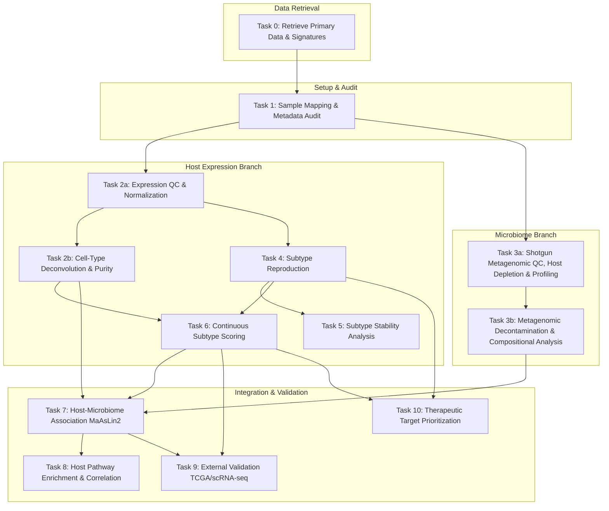

# Task Directed Acyclic Graph (DAG)

This document defines the computational pipeline, highlighting task dependencies, inputs, outputs, parallel execution blocks, and quality gates.

---

## 1. Pipeline Diagram

---

## 2. Detailed Task Definitions

### Task 0: Retrieve Primary Data & Signatures
*   **Description:** Download GSE172356 expression data, PRJNA719915 raw shotgun metagenomic FASTQ data, and Moffitt signatures.
*   **Inputs:** NCBI GEO/SRA database accessions, Moffitt Nature Genetics (2015) publication.
*   **Outputs:** Raw expression counts, raw shotgun metagenomic reads, gene signature files.
*   **Parallel Status:** None.

### Task 1: Sample Mapping & Metadata Audit
*   **Description:** Generate a patient-sample mapping master file and verify metadata.
*   **Inputs:** GSE172356 and PRJNA719915 metadata tables.
*   **Outputs:** `01_metadata/sample_mapping.tsv`
*   **Parallel Status:** None.

### Task 2a: Expression QC & Normalization
*   **Description:** QC of host RNA-seq, count filtering, log2/VST normalization.
*   **Inputs:** Raw expression matrix.
*   **Outputs:** Cleaned, normalized gene expression matrix.
*   **Parallel Status:** Can run in parallel with **Task 3a**.

### Task 2b: Cell-Type Deconvolution & Purity Estimation
*   **Description:** Run ESTIMATE and ConsensusTME to compute tumor purity and cell fractions.
*   **Inputs:** Normalized expression matrix.
*   **Outputs:** `03_processed/expression/tumor_purity_deconvolution.tsv`
*   **Parallel Status:** Can run in parallel with **Task 3b** and **Task 4**.

### Task 3a: Shotgun Metagenomic QC, Host Depletion & Profiling
*   **Description:** Run FastQC/MultiQC and fastp/Trimmomatic on raw reads, align to GRCh38 using Bowtie2/BWA-MEM to deplete host reads, and profile taxonomy with Kraken2/Bracken and/or MetaPhlAn, including sensitivity analysis across methods and functional profiling with HUMAnN where supported.
*   **Inputs:** Raw metagenomic FASTQ files.
*   **Outputs:** Cleaned non-human reads, taxonomic abundance tables (Kraken2/Bracken and MetaPhlAn), functional profiling tables.
*   **Parallel Status:** Can run in parallel with **Task 2a**.

### Task 3b: Metagenomic Decontamination & Compositional Correction
*   **Description:** Apply `decontam` R package (prevalence and frequency methods) to filter contamination, apply abundance/prevalence filtering, and perform Centered Log-Ratio (CLR) transformation on abundance tables.
*   **Inputs:** Raw taxonomic/functional abundance tables, negative control metadata.
*   **Outputs:** Decontaminated taxonomic and functional tables (raw & CLR transformed).
*   **Parallel Status:** Can run in parallel with **Task 2b**, **Task 4**, and **Task 5**.

### Task 4: Subtype Reproduction
*   **Description:** Replicate $k=3$ consensus clustering from Guo et al. (2021).
*   **Inputs:** Normalized expression matrix, Moffitt signature genes.
*   **Outputs:** Table matching each sample to its reproduced discrete subtype.
*   **Parallel Status:** Can run in parallel with **Task 3b**.

### Task 5: Subtype Stability Analysis
*   **Description:** Silhouette analysis, CDF plotting, bootstrapping, and comparison with random gene sets.
*   **Inputs:** Reproduced subtypes, consensus matrix, normalized expression matrix.
*   **Outputs:** Stability metrics (silhouette widths, Jaccard indices, CDF plots).
*   **Parallel Status:** Can run in parallel with **Task 3b** and **Task 6**.

### Task 6: Continuous Subtype Scoring
*   **Description:** Compute continuous Subtype Axis Scores using ssGSEA/NMF and test for multimodality.
*   **Inputs:** Normalized expression matrix, Moffitt signatures.
*   **Outputs:** Sample-level continuous scores, Hartigan's Dip Test statistic.
*   **Parallel Status:** Can run in parallel with **Task 5**.

### Task 7: Host-Microbiome Association
*   **Description:** Regress taxon abundance against continuous/discrete host subtyping using MaAsLin2, ANCOM-BC, and ALDEx2, adjusting for tumor purity and other covariates.
*   **Inputs:** Decontaminated CLR microbiome table, continuous host scores, deconvolution covariates.
*   **Outputs:** Tables of significantly associated taxa with coefficients and FDR values.
*   **Parallel Status:** None (requires both branches to be complete).

### Task 8: Host Pathway Enrichment & Correlation
*   **Description:** Conduct GSEA for host pathways and correlate scores with target taxons.
*   **Inputs:** Gene expression matrix, taxon abundance table, Hallmark gene sets.
*   **Outputs:** Pathway correlation tables and enrichment plots.
*   **Parallel Status:** Can run in parallel with **Task 9**.

### Task 9: External Validation
*   **Description:** Validate continuous gradient and molecular features in TCGA-PAAD and scRNA-seq. TCGA-PAAD primarily supports host transcriptomic validation; any TCGA-derived microbiome signal must be treated as exploratory due to batch and contamination concerns, and we do not assume that an identical external paired transcriptome-microbiome cohort exists.
*   **Inputs:** TCGA expression, scRNA-seq expression, spatial transcriptomics.
*   **Outputs:** Validation coefficients, Dip Test statistics in external cohorts, cell-type mapping.
*   **Parallel Status:** Can run in parallel with **Task 8** and **Task 10**.

### Task 10: Therapeutic Target Prioritization
*   **Description:** Filter overexpressed basal-like genes through DepMap dependency scores, DGIdb, ChEMBL, and survival databases.
*   **Inputs:** Basal-like DEGs, DepMap datasets, DGIdb and ChEMBL tables.
*   **Outputs:** Prioritized target vulnerability matrix.
*   **Parallel Status:** Can run in parallel with **Task 9**.

---

## 3. Mandatory Stopping Checkpoints & Quality Gates

The pipeline must not proceed past these checkpoints unless all success criteria are met:

### Checkpoint 1: Sample Mapping Concordance (Gating Task 2a/3a)
*   **Gating Question:** Do we have corresponding, high-quality metadata for both the expression (GEO) and microbiome (BioProject) datasets, and do they map to the same set of patients?
*   **Success Criteria:** $100\%$ concordance in sample mapping for the $n=62$ tumor samples, or documented exclusion criteria for any mismatched samples. All negative controls must have clear sequencing ID mapping.

### Checkpoint 2: Expression QC and Outlier Audit (Gating Task 4)
*   **Gating Question:** Do normalized expression files display major batch effects or sample anomalies that will bias consensus clustering?
*   **Success Criteria:** No samples with library size $< 5$ million reads or transcriptomic outliers ($> 3$ standard deviations away from the mean in PCA space). If batch effects are detected, a batch correction script must be executed and verified (batch effect accounts for $< 5\%$ of variance post-correction).

### Checkpoint 3: Microbiome Contamination Filtering (Gating Task 7)
*   **Gating Question:** Have kit, environmental, and PCR contaminants been successfully filtered, and are there sufficient biological signals remaining?
*   **Success Criteria:** Contaminant identification using R `decontam` executed with at least two methods (prevalence and frequency). The remaining decontaminated microbiome table must contain at least 50 non-zero taxonomic/functional features (genera/species) for testing, with library sizes of samples exceeding 1,000 reads post-filtering (`TO VERIFY` exact read cutoff).

### Checkpoint 4: Subtype Assignment Validation (Gating Task 6/7)
*   **Gating Question:** Does our discrete subtype classification reproduce the assignments reported in the published study?
*   **Success Criteria:** Concordance between our classification and the original study's assignments must yield a Cohen's Kappa $\ge 0.90$. Any discrepancies must be traced to code, filtering, or normalization differences and documented.

### Checkpoint 5: FDR & Multi-Testing Guard (Gating Manuscript Draft)
*   **Gating Question:** Are all reports of "subtype-associated" taxa and host pathways guarded against false positives and data leakage?
*   **Success Criteria:** All reported associations have Benjamini-Hochberg FDR $q < 0.05$. Feature selection for any machine-learning classifiers was conducted entirely within cross-validation loops (no leakage).
